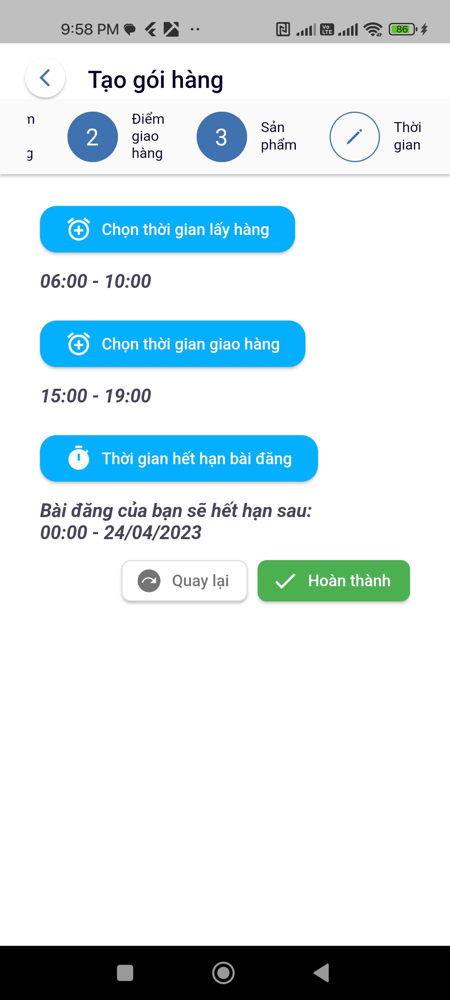

## Thank for visiting. This is some images about user interface of our application.

# Convenient way for delivery application (Ứng dụng giao hàng tiện đường)

### Mobile application (Flutter)

    
    

   
    

    
    

    
    

    
    

    
    

    
    

    
    

    
    

    
    

        
    

### Web application (ReactJS)

